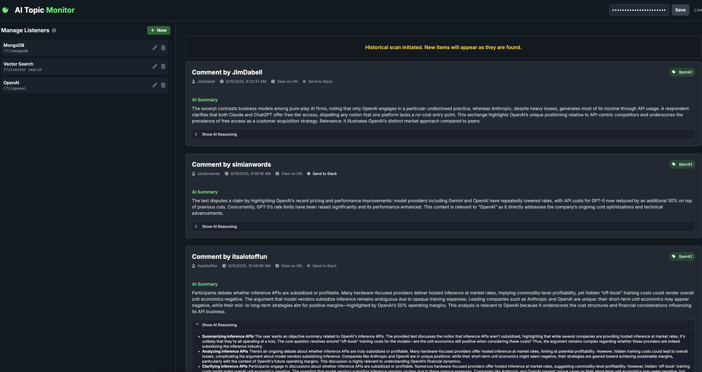

# the-eye-of-sauron

---

**Behold “The Eye of Sauron”—an AI sentinel that never blinks.** Inspired by the all-seeing tower from Tolkien’s legend, this project constantly scans the web for your chosen keywords, highlights hidden gems, and serves up bite-sized insights you can act on in seconds.  
  
Imagine peering into a swirling crystal ball of real-time data. Instead of endless scrolling, this tool quietly monitors sources like Hacker News, seeking out mentions of “MongoDB” or “OpenAI,” and automatically generating concise summaries of each matching post. With the help of an AI model, every note is stripped of fluff, leaving only the core essence and relevance.  
  
This “Eye of Sauron” doesn’t just spot content—it also makes it actionable. A Slack button sends updates to your team’s channel, cutting through digital noise and delivering fresh leads to the places that matter. Under the hood, threaded workers comb through incoming items, while a live server-sent feed streams fresh discoveries straight into the browser.  
  
Ultimately, the magic of “The Eye” lies in its relentless curiosity. It’s on the lookout 24/7, scanning thousands of posts, distilling them into a handful of takeaways—just enough to spark your next idea. If you’ve ever wanted a tireless watchtower that helps you stay ahead of conversation trends, you’ve found your mythical solution in this all-seeing Eye. Stay informed, stay curious, and let the Eye do the watching for you.

**Never Miss a Beat: Introducing an Ever-Watchful AI**  
  
We’ve all been there: You open your laptop and see a tidal wave of updates—new projects launched, fresh commentary on the latest frameworks, passionate debates about emerging tech. Blink, and you risk missing *the* next big thing. In an everchanging landscape where yesterday’s story is old news by lunch, it’s easy to feel out of the loop.   
  
Imagine having a personal research assistant who never sleeps. That’s exactly what “The Eye of Sauron” offers. By constantly scanning live feeds (think Hacker News or your favorite sources), it sniffs out mentions of anything you’re tracking: “MongoDB,” “Vector Search,” “OpenAI,” you name it. Within seconds, you get a ding: “Here’s something new,” plus a succinct AI-generated summary of what’s being said. Instead of digging through endless text, you’re free to spot trends and connect dots in a fraction of the time.  
  
Why does this matter so much right now? Tech is moving at warp speed. Every day, there’s a new framework, a new approach, a new success story—and plenty of noisy chatter in between. If you’re juggling project deadlines or forging a startup strategy, digesting and filtering all that information can feel like a full-time job. This platform zeroes in on *only* what matters and packages it neatly, so you can shift from “catching up” to “charting the next move.”  
  
And it’s not just about passively reading headlines; the Eye of Sauron gives you context for *why* a mention is relevant. Let’s say you’re laser-focused on cloud data solutions. Once the system pings a new post about “MongoDB,” you can skim an AI-powered summary right within your dashboard, decide if it’s worth a deeper look, and even fire off a quick Slack notification so your entire team stays in the loop.   
  
Ultimately, it’s about reclaiming your time and energy. No more frantic scanning of 10 different sites. No more FOMO-induced clicking on every link. When something big happens in your niche, you’ll know—*and know quickly*. As our digital world continues to race forward at breathtaking speed, having a tireless digital ally watching your back is a game changer.   
  
So, if you’re ready to stop playing catch-up and start getting ahead, it might be time to let the Eye of Sauron do the watching for you. Watch it turn the noisy chaos of online chatter into crisp, AI-driven alerts. You’ll wonder how you ever scrolled without it.

**Practical Tips for Getting Started**
  
1. **Start with a Narrow Scope**    
   Pick a few key topics or keywords to monitor before expanding your list. This keeps the initial signal-to-noise ratio high and gives you confidence in the pipeline.  
  
2. **Use Summaries for Quick Triage**    
   Even the best filtering still yields a decent volume of content. AI-generated summaries let you see value at a glance without reading every line.  
  
3. **Integrate with Collaboration Tools**    
   Whether it’s Slack, Microsoft Teams, or email, make sure your pipeline can push notifications. Knowledge is most actionable when it’s shared immediately with decision-makers.  
  
4. **Refine Patterns Over Time**    
   Regularly review and update your patterns to focus on the most relevant keywords. Retire old or low-value listeners, and add new ones as your business intelligence needs evolve.  
  
