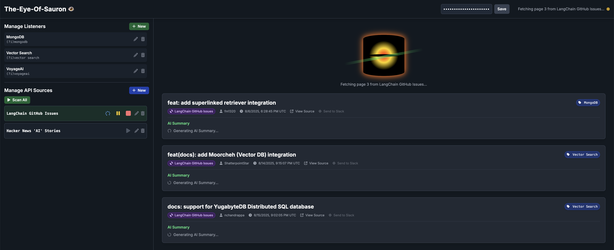

# the-eye-of-sauron



---

**Behold “The Eye of Sauron”—an AI sentinel that never blinks.** Inspired by the all-seeing tower from Tolkien’s legend, this project constantly scans the web for your chosen keywords, highlights hidden gems, and serves up bite-sized insights you can act on in seconds.  
  
Imagine peering into a swirling crystal ball of real-time data. Instead of endless scrolling, this tool quietly monitors sources like Hacker News, seeking out mentions of “MongoDB” or “OpenAI,” and automatically generating concise summaries of each matching post. With the help of an AI model, every note is stripped of fluff, leaving only the core essence and relevance.  
  
This “Eye of Sauron” doesn’t just spot content—it also makes it actionable. A Slack button sends updates to your team’s channel, cutting through digital noise and delivering fresh leads to the places that matter. Under the hood, threaded workers comb through incoming items, while a live server-sent feed streams fresh discoveries straight into the browser.  
  
Ultimately, the magic of “The Eye” lies in its relentless curiosity. It’s on the lookout 24/7, scanning thousands of posts, distilling them into a handful of takeaways—just enough to spark your next idea. If you’ve ever wanted a tireless watchtower that helps you stay ahead of conversation trends, you’ve found your mythical solution in this all-seeing Eye. Stay informed, stay curious, and let the Eye do the watching for you.

**Never Miss a Beat: Introducing an Ever-Watchful AI**  
  
We’ve all been there: You open your laptop and see a tidal wave of updates—new projects launched, fresh commentary on the latest frameworks, passionate debates about emerging tech. Blink, and you risk missing *the* next big thing. In an everchanging landscape where yesterday’s story is old news by lunch, it’s easy to feel out of the loop.   
  
Imagine having a personal research assistant who never sleeps. That’s exactly what “The Eye of Sauron” offers. By constantly scanning live feeds (think Hacker News or your favorite sources), it sniffs out mentions of anything you’re tracking: “MongoDB,” “Vector Search,” “OpenAI,” you name it. Within seconds, you get a ding: “Here’s something new,” plus a succinct AI-generated summary of what’s being said. Instead of digging through endless text, you’re free to spot trends and connect dots in a fraction of the time.  
  
Why does this matter so much right now? Tech is moving at warp speed. Every day, there’s a new framework, a new approach, a new success story—and plenty of noisy chatter in between. If you’re juggling project deadlines or forging a startup strategy, digesting and filtering all that information can feel like a full-time job. This platform zeroes in on *only* what matters and packages it neatly, so you can shift from “catching up” to “charting the next move.”  
  
And it’s not just about passively reading headlines; the Eye of Sauron gives you context for *why* a mention is relevant. Let’s say you’re laser-focused on cloud data solutions. Once the system pings a new post about “MongoDB,” you can skim an AI-powered summary right within your dashboard, decide if it’s worth a deeper look, and even fire off a quick Slack notification so your entire team stays in the loop.   
  
Ultimately, it’s about reclaiming your time and energy. No more frantic scanning of 10 different sites. No more FOMO-induced clicking on every link. When something big happens in your niche, you’ll know—*and know quickly*. As our digital world continues to race forward at breathtaking speed, having a tireless digital ally watching your back is a game changer.   
  
So, if you’re ready to stop playing catch-up and start getting ahead, it might be time to let the Eye of Sauron do the watching for you. Watch it turn the noisy chaos of online chatter into crisp, AI-driven alerts. You’ll wonder how you ever scrolled without it.

***

## Appendix: Streamlining Advanced Search with a Unified Platform

Implementing sophisticated search capabilities, such as hybrid search, has traditionally been a complex engineering challenge. Teams often had to stitch together multiple specialized systems—one for keyword-based text search and another for semantic vector search. This approach introduces significant overhead, requiring developers to write, manage, and maintain complex application-layer code just to synchronize data and merge results from these disparate sources.

However, a modern data platform can abstract away this complexity. By integrating diverse search capabilities directly into the database core, it's possible to shift the burden of implementation from the application to the platform itself.

This is particularly evident within the MongoDB Atlas aggregation framework. The framework is designed to let developers build powerful, multi-stage data processing pipelines with declarative syntax. Instead of writing procedural code to fetch, filter, and transform data, developers can simply define the desired outcome, trusting the database to execute the steps efficiently.

With the introduction of features in Atlas 8.1, this paradigm extends naturally to advanced search. A developer can now construct a single, elegant aggregation pipeline that seamlessly combines different search methodologies. For instance, a pipeline can include a stage for semantic vector search and another for traditional full-text search. The crucial next step—merging, de-duplicating, and intelligently re-ranking the results based on a weighted score—is no longer a task for the application. It becomes just another stage in the pipeline, handled natively by the database.

By trusting the aggregation framework, the implementation of a once-complex hybrid search system is reduced to defining a single query. This dramatically minimizes the amount of custom code required, accelerates development cycles, and allows teams to deliver powerful, relevant search experiences with a fraction of the traditional effort.


## Appendix: A Developer's Guide to Mastering the MongoDB `upsert`

You’re building a feature that needs to be fast and reliable—maybe a real-time analytics dashboard. You've designed a clever `update` operation with `upsert=True` to handle creating documents and modifying them in one elegant, atomic command. It looks perfect on paper. You run your code, and then... **BAM**. A cryptic error message stops you in your tracks.

```
Updating the path 'matchesByLabel' would create a conflict at 'matchesByLabel'
```

If you've hit this roadblock, congratulations. You're about to level up your understanding of MongoDB's data modeling. This isn't a bug; it's the database telling you a powerful secret about how it works. Let's decode it.

### The Scene of the Crime: The Conflicting `upsert`

Imagine you're tracking keyword mentions for your dashboard. The first time a keyword is mentioned on a new day, you want to create a daily stats document and, in the same operation, increment the counter for that specific keyword. Your `upsert` might look something like this:

#### The Conflicting Code

```python
# BAD CODE: This will cause a path conflict on the first run of the day.

update_op = {
    '$inc': {
        # This tries to modify a sub-field inside 'matchesByLabel'.
        'matchesByLabel.MongoDB': 1    #<-- 💥 CONFLICT - Instruction #1
    },
    '$setOnInsert': {
        '_id': '2025-08-16',
        'date': '2025-08-16',
        # This tries to create the 'matchesByLabel' field itself.
        'matchesByLabel': {}           #<-- 💥 CONFLICT - Instruction #2
    }
}

# db.daily_stats.update_one({'_id': '2025-08-16'}, update_op, upsert=True)
```

You've just handed MongoDB a set of logically impossible instructions for when it creates a *new* document. You've told it to:

1.  Create a parent field called `matchesByLabel` and set its value to an empty object (`{}`).
2.  Simultaneously, reach *inside* that `matchesByLabel` field to increment the `MongoDB` counter.

You can't place a new, empty folder labeled "Keyword Matches" on a shelf and, in the same single action, also write a "MongoDB: 1" tally inside it. The instructions are for the same path but are fundamentally at odds in an atomic operation. This is the **path conflict**.

-----

### The "Aha\!" Moment: Trusting the Document Model

So, if you can't micromanage the document's creation, what's the alternative? The answer is to change your mindset. Instead of telling MongoDB *how* to build the structure, **just tell it what you want to achieve** and trust its operators.

This is where MongoDB's **flexible document model** becomes your superpower. Operators like `$inc` are designed to create the necessary fields and objects if they don't already exist.

#### The Corrected Code

By removing the conflicting keys from `$setOnInsert`, we let `$inc` do the heavy lifting for the counter fields.

```python
# GOOD CODE: This is simpler, faster, and leverages MongoDB's flexibility.

update_op = {
    '$inc': {
        # This instruction now runs without conflict. If 'matchesByLabel'
        # doesn't exist, $inc will create it as an object before
        # adding and incrementing the 'MongoDB' field.
        'matchesByLabel.MongoDB': 1
    },
    '$setOnInsert': {
        # We only set fields that are truly static and never modified by other operators.
        '_id': '2025-08-16',
        'date': '2025-08-16'
        # 'matchesByLabel' was removed. That is the entire fix!
    }
}

# db.daily_stats.update_one({'_id': '2025-08-16'}, update_op, upsert=True)
```

While our example focused on analytics, this principle applies everywhere. Imagine tracking user login events with `$push` or managing unique tags with `$addToSet`. In all these cases, you don't need to initialize the parent array in `$setOnInsert`. The operators are smart enough to do it for you.

-----

### The Golden Rule: Model for Your Access Patterns 💡

This scenario perfectly illustrates the most important concept for a great MongoDB experience: **design your data model to match how your application reads and writes data.**

Our dashboard has a **write-heavy access pattern**—it needs to perform many small, fast increment operations in real time. Our solution optimized for this pattern by making the write operation as lean and simple as possible.

> **Your data model should be optimized for your application's most frequent operations.**

This creates a powerful separation of concerns:

  * **The Write Path is Fast:** Your database is optimized for high-speed, concurrent writes by letting operators build the document structure organically.
  * **The Read Path is Consistent:** The API endpoint that serves your dashboard is responsible for ensuring the data is clean. It can take a "sparse" document from the database (where some fields might be missing) and merge it with a complete default structure, so your frontend always receives a predictable object.

By understanding how you will access your data, you can design a schema that avoids performance bottlenecks and logical errors. This is the key to unlocking the full power and scalability of MongoDB.

**The Developer's Rule of Thumb:** When performing an `upsert`, operators that modify *within* a path (like `$inc`, `$push`, `$addToSet`) and operators that set the *entire* path (like in `$setOnInsert`) cannot target the same parent path. **Let your write operators shape your document.** Trust them to build what they need—that's how you unlock a truly great MongoDB experience.
