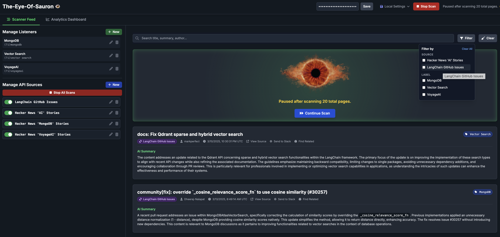

# The Eye of Sauron: An AI Sentinel That Never Blinks



We’ve all been there: you open your laptop to a tidal wave of updates—new projects launched, fresh commentary on the latest frameworks, and passionate debates about emerging tech. Blink, and you risk missing the next big thing. In a landscape where yesterday’s story is old news by lunchtime, it’s easy to feel out of the loop.

Imagine having a personal research assistant who never sleeps. Behold **“The Eye of Sauron”**—an AI sentinel inspired by the all-seeing tower from Tolkien’s legend. This project constantly scans the web for your chosen keywords, highlights hidden gems, and serves up bite-sized insights you can act on in seconds. Instead of endless scrolling, this tool quietly monitors sources like Hacker News, seeking out mentions of “MongoDB” or “OpenAI,” and automatically generating concise summaries of each matching post.

Why does this matter so much right now? Tech is moving at warp speed. If you’re juggling project deadlines or forging a startup strategy, digesting all that information can feel like a full-time job. This platform zeroes in on *only* what matters and packages it neatly, so you can shift from “catching up” to “charting the next move.”

The Eye doesn’t just spot content—it makes it actionable. A Slack button sends updates to your team’s channel, cutting through the digital noise. Under the hood, threaded workers comb through incoming items, while a live server-sent feed streams discoveries straight to your browser.

-----

## The Power Behind the Eye: Why MongoDB Atlas?


> **💡 Upgrade for Power: Requires MongoDB 8.1+**
>
> The `$rankFusion` operator, the engine behind our intelligent hybrid search, is available in MongoDB 8.1 and later. This powerful capability is a compelling reason to upgrade and take advantage of the latest features for building modern, AI-powered applications.

Building advanced hybrid search is complex, but it shouldn't require you to become an expert system integrator. Manually stitching together separate text search and vector database APIs creates a brittle, high-maintenance system that is a constant drain on engineering resources.

**MongoDB Atlas** introduces native commands like **`$rankFusion`** that handle the entire hybrid search workload in a single, efficient query. Instead of writing complex application code to merge and rank results from different systems, you define your entire search logic declaratively within the database.

This approach eliminates brittle "glue code," reduces architectural complexity, and insulates you from the instability of the rapidly changing AI ecosystem. By using a unified platform, you get state-of-the-art search capabilities without the technical debt, allowing you to focus on building features, not managing integrations.

***

### The Golden Rule: Model for Your Access Patterns 💡

This scenario perfectly illustrates the most important concept for a great MongoDB experience: **design your data model to match how your application reads and writes data.**

Our dashboard has a **write-heavy access pattern**—it needs to perform many small, fast increment operations in real time. Our solution optimized for this pattern by making the write operation as lean and simple as possible.

> **Your data model should be optimized for your application's most frequent operations.**

This creates a powerful separation of concerns:

  * **The Write Path is Fast:** Your database is optimized for high-speed, concurrent writes by letting operators build the document structure organically.
  * **The Read Path is Consistent:** The API endpoint that serves your dashboard is responsible for ensuring the data is clean. It can take a "sparse" document from the database (where some fields might be missing) and merge it with a complete default structure, so your frontend always receives a predictable object.

By understanding how you will access your data, you can design a schema that avoids performance bottlenecks and logical errors. This is the key to unlocking the full power and scalability of MongoDB.

**The Developer's Rule of Thumb:** When performing an `upsert`, operators that modify *within* a path (like `$inc`, `$push`, `$addToSet`) and operators that set the *entire* path (like in `$setOnInsert`) cannot target the same parent path. **Let your write operators shape your document.** Trust them to build what they need—that's how you unlock a truly great MongoDB experience.

## Conclusion

We’ve all seen the chaos. To build a modern application, you're expected to piece together a Frankenstein's monster of databases: a relational store for user data, a search engine for text, and now a vector database for AI. The promise is "best-of-breed," but the reality is an architectural nightmare—a tangle of glue code, data synchronization issues, and operational overhead.

That's a problem we set out to solve with **"The Eye of Sauron."**

This project isn't a product; it’s an experiment. What if we approached this challenge from a different angle? What if, instead of starting with a mess of tools, we started with a single, powerful data platform and let it handle everything?

Our goal was to build a powerful AI sentinel that could handle the entire data pipeline: from ingesting messy, chaotic JSON from public APIs, to performing sophisticated text and vector searches, to generating real-time analytics. We needed a single platform to be the foundation for all these disparate workloads.

And that’s where the magic happened. By focusing on a single, unified data layer, we were able to build "The Eye of Sauron" with remarkable speed and simplicity. We were able to use a single API, a single security model, and most importantly, a single query language to manage it all. We eliminated the "integration tax," and the performance gains were incredible.

As developers, we’re all looking for the right tool for the job. Our hope is that this project will show you, as it showed us, that a single, intelligent data platform can be the one true foundation for building the next generation of applications. The tools we used are what made this possible, and the story of how they came together is one worth sharing.

-----

-----

## Appendix: The Strategic Case for an Integrated Data Platform

This appendix explores the architectural philosophy behind "The Eye of Sauron," making the case for why a unified data platform like MongoDB Atlas is not just a convenience, but a critical strategic advantage for modern development teams.

### TL;DR: Why Build on a Unified Platform?

  * **Eliminate Complexity:** Stop wasting engineering cycles on "glue code" and data synchronization between disparate systems. A single, consistent API for all your data workloads radically simplifies development.
  * **Move Faster:** By removing the integration tax, your team can focus on shipping features that deliver business value, not on managing a brittle, multi-headed data infrastructure.
  * **Reduce Operational Risk:** A unified platform offers a single security model and isolated workloads, preventing issues in one area (like a heavy search query) from impacting another (like core application performance).
  * **Future-Proof Your Stack:** Gain access to an entire ecosystem of data services without having to re-architect your application. Go from search to time-series analysis to data federation with a simple configuration change, not a six-month migration project.

### The "Best-of-Breed" Dream and the Integration Nightmare

Every modern application starts with a familiar dream. We'll use the "best" tool for every job: a rock-solid relational database for our core transactions, a powerful search engine for text, and a cutting-edge vector database for our new AI features. On paper, it’s a perfect assembly of specialized experts.

In reality, this dream quickly becomes an integration nightmare. Your team is now responsible for writing, deploying, and maintaining the brittle "glue code" that holds everything together. You face constant questions:

  * **Synchronization:** How do we keep the search index, the vector index, and the primary database perfectly in sync? Do we use fragile dual-writes, or do we build a complex and laggy event-sourcing pipeline?
  * **Consistency:** What happens when a write succeeds in one system but fails in another? How do you ensure atomic operations across three different APIs with different transactional guarantees?
  * **Operational Overhead:** Your developers now need to be experts in three different query languages, three different security models, and three different deployment patterns. The cognitive load skyrockets, and productivity plummets.

This is the "best-of-breed" tax. You spend more time managing integrations than building features. The project's architecture, which was supposed to be a strength, becomes its greatest liability.

### A Better Way: The Integrated Platform in Action

"The Eye of Sauron" was built on a different philosophy: an integrated data platform is a strategic asset. Instead of wrestling with three systems, we use one—MongoDB Atlas—to handle everything. This isn't about compromise; it's about intelligent design.

#### Example 1: Elegant Hybrid Search

The "Find Related" feature is a perfect illustration. It needs to combine conceptual vector search with traditional keyword search. In a disintegrated stack, this would require querying two separate databases and then writing complex, inefficient application code to merge and re-rank the results.

With Atlas, it's a single, declarative query using the **`$rankFusion`** operator. We simply tell the database our intent:

  * **The Conceptual Analyst (`vectorPipeline`):** Find documents with similar *meaning*.
  * **The Keyword Archivist (`fullTextPipeline`):** Find documents with similar *terms*.

The database handles the fusion logic internally, giving us a superior, blended result without any of the integration pain.

#### Example 2: Atomic and Intuitive Operations

The challenge of mastering the `upsert` operation reveals another deep benefit of integration. When tracking daily keyword statistics, we need to create a document on the first mention of the day and increment a counter within it—all in one atomic step.

A common mistake is to try to manage the document's structure from the application, leading to a path conflict:

```python
# BAD CODE: Causes a path conflict by managing structure from two operators.
update_op = {
    '$inc': { 'matchesByLabel.MongoDB': 1 },
    '$setOnInsert': { 'matchesByLabel': {} } #<-- Redundant and conflicting
}
```

The integrated model provides a simpler, more powerful way. We trust the `$inc` operator to create the necessary document structure on its own. The code becomes lean, fast, and bug-free because the operation is handled atomically inside the database engine, where it belongs. This is an elegance you can't achieve when your data is spread across multiple systems with no shared context.

### Addressing the Hard Questions

  * **On Performance (The "Noisy Neighbor" Problem):** The fear that a heavy search query could slow down your main application is valid—in a naive system. But this is a solved problem. **Atlas Search Nodes provide complete computational isolation.** Think of it as giving your search workload its own soundproofed apartment in the same luxury building as your database. You get the convenience of a unified API, **not a unified blast radius.**
  * **On Lock-In (The "Strategic Commitment"):** Critics call it "lock-in"; professionals call it a "strategic commitment." You don't worry about "locking yourself into" React or Vue; **you choose a framework so you don't have to build a rendering engine from scratch.** Committing to the Atlas platform is the same principle. You're outsourcing the immense R\&D cost of keeping up with the AI arms race and a dozen other data problems, freeing your team to focus on what makes your application unique.

### Beyond Search: Your Data Platform’s Next Evolution

The power of this approach is that it grows with you. Today, "The Eye of Sauron" uses integrated document storage, full-text search, and vector search. But what about tomorrow?

When the need arises, the same platform is ready to:

  * **Federate queries** to data stored in S3 or other cloud databases without moving it.
  * Automatically move aging data to a low-cost **Online Archive** to save money.
  * Handle high-frequency event streams with optimized **Time Series collections**.
  * Perform searches on fully encrypted data—while it remains encrypted on the server—using **Queryable Encryption**.

Each of these is a feature you can turn on, not a new system you have to build. This is the ultimate promise of an integrated data platform: it’s a foundation that lets you build for today's needs with the confidence that you are ready for tomorrow's challenges.

----

## Appendix: The Dream Team for AI Search: VoyageAI + MongoDB Atlas

The intelligence of any AI-powered search system hinges on two critical components: the quality of its understanding and the power of its retrieval engine. In "The Eye of Sauron," the "Find Related" feature exemplifies the synergy between a best-in-class embedding model from **VoyageAI** and the unified data platform of **MongoDB Atlas**. This combination isn't just an implementation detail—it's a strategic choice that delivers superior relevance without architectural compromises.

### VoyageAI: The Semantic Savant

At the heart of our conceptual search is the vector embedding—a dense numerical representation of meaning. The quality of this embedding dictates how well the system can grasp nuance, context, and intent. While many models can generate vectors, VoyageAI specializes in creating state-of-the-art embeddings optimized for retrieval tasks.

Think of the embedding model as the "Conceptual Analyst" from our search explanation. By integrating VoyageAI, we are essentially giving that analyst a significant upgrade.

* **Unmatched Semantic Depth:** VoyageAI's models are trained to excel at understanding complex relationships in text, resulting in embeddings that capture subtle semantic links other models might miss. This means "Find Related" can connect a bug report about "slow query performance" to a news article discussing "database indexing strategies" even if they share no keywords.
* **A Pluggable Brain for Your Application:** The AI landscape evolves at an astonishing pace. Today's top model might be superseded tomorrow. Our architecture treats the embedding provider as a "pluggable brain." Thanks to a simple configuration switch, we can swap between Azure's embedding models and VoyageAI's in seconds. This flexibility is a massive strategic advantage, allowing us to upgrade our application's "intelligence" without re-architecting the core data layer.

### MongoDB Atlas: The Unified Retrieval Engine

Generating brilliant embeddings is only half the battle. You need a database that can store, index, and query these high-dimensional vectors at scale, right alongside the rest of your data. This is where MongoDB Atlas shines, completely eliminating the need for a separate, standalone vector database.

The "integration nightmare" described earlier is a real and painful tax on development teams. By using Atlas Vector Search, we sidestep it entirely:

1.  **Store Everything, Together:** The vector embedding from VoyageAI is stored as just another field in our JSON document. The content, its metadata, and its semantic representation live together in a single, coherent record.
2.  **Query Everything, Together:** With `$rankFusion`, we craft a single, elegant query that combines the conceptual insights from VoyageAI's vectors with the precision of full-text search. There is no brittle "glue code," no network latency between two different databases, and no complex logic in the application layer to merge results. The database does the heavy lifting.

### The Power of the Partnership

The combination of VoyageAI and MongoDB Atlas creates a system that is greater than the sum of its parts. We get the specialized power of a world-class AI model without sacrificing the operational simplicity and developer experience of an integrated data platform. This allows "The Eye of Sauron" to deliver incredibly relevant results, adapt to future AI innovations, and remain a clean, maintainable, and scalable application. It's the modern blueprint for building sophisticated, AI-native features without the technical debt.


While VoyageAI has a strong reputation, the provided text contains some factual claims that are misleading or require more context. Here is an analysis of each point and a corrected, more objective version suitable for a blog post section.

#### VoyageAI vs. OpenAI: A Deeper Look

* **Performance:** VoyageAI is well-regarded for its specialized embedding models. Its models, such as `voyage-3.5-lite`, are specifically engineered for tasks like semantic search and retrieval. This specialization often gives them a performance edge in many industry benchmarks, making them a strong choice for applications where retrieval accuracy is paramount.
* **Cost & Speed:** Generally, VoyageAI models are more cost-effective and faster than OpenAI's general-purpose text embedding models. Since they are streamlined for a single purpose, they can offer significant savings on a per-token basis while also reducing latency, which is crucial for real-time applications.
* **Flexibility & Ecosystem:** Both companies provide robust APIs for their embedding models, allowing developers to integrate them into their applications and fine-tune them for specific use cases. OpenAI, with its broader suite of LLMs, might offer a more cohesive ecosystem if you plan to use its other services for tasks like text generation. VoyageAI, on the other hand, is a leader in a specific niche, focusing on providing a top-tier solution for embeddings.

Ultimately, the best choice depends on your specific needs. If your priority is maximum retrieval accuracy and cost efficiency, a specialized provider like VoyageAI may be a superior option. If you are already deeply integrated into the OpenAI ecosystem and want a single vendor for both embeddings and LLMs, using their models might be more convenient.

---

## Appendix: Analytics Architecture—A Tale of Two Collections

When designing the analytics engine for "The Eye of Sauron," we faced a critical architectural choice: how should we count and store our real-time statistics? This decision perfectly illustrates MongoDB's flexibility and the importance of modeling for your specific access patterns. The two primary contenders were a standard document collection using atomic operators and a purpose-built Time Series collection.

Here’s a breakdown of why we chose the standard collection for this specific dashboard use case, and when you would absolutely want to use a Time Series collection instead.

-----

### Our Approach: The Single-Document Dashboard Model

Our analytics are stored in a standard collection where each document represents a single day (e.g., `_id: "2025-08-17"`). We update this document using the `$inc` operator.

```javascript
// A document in our 'daily_stats' collection
{
  "_id": "2025-08-17",
  "totalItemsMatched": 142,
  "matchesByLabel": {
    "MongoDB": 56,
    "Vector Search": 86
  },
  // ... other stats
}
```

This model was chosen for three key reasons tailored to our primary access pattern—powering the dashboard:

1.  **Blazing-Fast Dashboard Reads:** The dashboard's main job is to show "stats for today." With this model, fetching all the data required to render the entire analytics view is a single, hyper-efficient `findOne()` operation targeted by `_id`. It is, quite simply, the fastest possible way to read data from MongoDB.

2.  **Simplicity for Low Cardinality Data:** Our analytics data has very low cardinality. We are tracking a few dozen metrics per day. We don't have millions of unique devices or sensors reporting every second. For this workload, a single document is clean, intuitive, and avoids the conceptual overhead of managing a more complex data structure.

3.  **Atomic Efficiency:** Using `$inc` is an incredibly fast, atomic, and conflict-free way to handle concurrent writes. Even with hundreds of workers processing items simultaneously, MongoDB's engine handles the increments in place without issue. For the volume of events Sauron generates, this approach is nowhere near a performance bottleneck.

> **In short: Our access pattern is "write often, but read all at once for a single day." A standard collection optimized for this specific read pattern delivers maximum performance for the user-facing dashboard.**

-----

### The Alternative: When to Use a Time Series Collection

So, if our model is so effective, why do Time Series collections exist? Because they are designed to solve a different, much larger-scale problem. You should immediately reach for a Time Series collection when your requirements change to include:

1.  **High-Volume, High-Frequency Data:** This is the canonical use case. Imagine you were logging metrics from thousands of application servers every second, tracking millions of IoT devices, or recording financial market data. A Time Series collection is specifically engineered to handle this massive ingest volume with minimal overhead.

2.  **Powerful Time-Window Analytics:** The real power of Time Series collections shines when your access pattern is analytical and time-bucketed. They are optimized for questions like:

      * "What was the average number of matches per hour over the last 30 days?"
      * "Show me the 95th percentile of summary generation latency, grouped in 5-minute windows."
      * "Compare the match volume of 'MongoDB' vs. 'OpenAI' week-over-week."

    These queries are complex aggregations over large time ranges, and Time Series collections are built to make them fast and efficient.

3.  **Automated Cost Savings at Scale (Online Archive & Data Federation):** For massive datasets, storage cost is a major concern. This is where a Time Series platform becomes a financial lifesaver. MongoDB can automatically move older, less-frequently accessed data from your hot, expensive primary cluster storage to low-cost cloud object storage like Amazon S3 using **Online Archive**. The amazing part is that this archived data remains fully queryable. You can run a single query that seamlessly fetches data from both your live cluster and your low-cost archive. This allows you to keep years of historical data accessible for analysis at a fraction of the cost, a feature that is indispensable for large-scale event logging but overkill for our simple daily dashboard.

### The Verdict: The Right Tool for the Job

The decision to use a standard collection was a deliberate choice rooted in the "Golden Rule"—**model for your access pattern.** For the specific needs of the Sauron dashboard, prioritizing instantaneous reads of a day's complete metrics provides the best user experience.

However, if our mission evolved to include long-term trend analysis or logging events at a much higher frequency, migrating to a Time Series collection would be the logical next step. This flexibility—to choose the perfect tool for the job within a single, integrated data platform—is a core strategic advantage of building on MongoDB Atlas.

---

## Appendix: How Find Related Works (EXPLAINED)


When you click "Find Related," you're asking the system to solve a classic intelligence problem: you have one important document, and you need to find all the other documents in a vast library that are truly related to it. A simple search is not enough. To do this effectively, the system employs two distinct specialists who attack the problem from different angles.

* **The Conceptual Analyst (`vectorPipeline`):** This specialist reads your source document and understands its deep, underlying *meaning*. It doesn't just see words; it grasps the intent and concepts being discussed. It then searches the entire collection for other items that are **conceptually similar**, even if they use completely different terminology. This analyst is brilliant at finding "unknown unknowns"—relevant items you wouldn't have thought to search for.

* **The Keyword Archivist (`fullTextPipeline`):** This specialist is a master of the library's index. It meticulously scans the `title` and `ai_summary` of every document for shared **keywords and phrases** with your source document. It excels at finding items that use the same specific terminology, ensuring that no document with a clear lexical connection is missed.

Neither specialist is perfect alone. The Analyst might find items that are too broad, while the Archivist can be overly literal and miss conceptual links. The true power comes from how we synthesize their findings. We don't just combine their lists; we use MongoDB's **`$rankFusion`** operator to perform an intelligent fusion. This process examines the *rank* of each item on both specialists' lists and creates a single, unified score. In this application, we've configured it to give **70% priority to the conceptual matches** from the Analyst and **30% to the keyword matches** from the Archivist. The result is a superior, blended ranking that delivers the best of both worlds: the deep understanding of an analyst, backed by the precision of an archivist.

-----

## Appendix: From JSON Chaos to Structured Data—The Point-and-Click Mapper


One of the biggest friction points in building any data aggregation tool is the chaotic, untamed nature of external APIs. Every API is a unique snowflake; they all speak a slightly different dialect of JSON. An author's name might be `user.login` in one, `author` in another, and simply `by` in a third. This variability creates a significant barrier, forcing developers to write brittle, custom parsers or manually wrestle with complex configurations just to get data into a usable format.

This is tedious, low-value work. To solve it, "The Eye of Sauron" was built on a simple but powerful principle: **empower the user to visually map any API structure to a consistent internal model, without writing a single line of code.**

### The "Universal Document" Model: Our North Star

At its core, Sauron normalizes all incoming data into a single, straightforward **document model**. Every piece of content, whether it's a GitHub issue or a news article, is transformed to fit this structure:

  * `id`: A unique identifier for the item.
  * `title`: The main headline.
  * `url`: A direct link to the original source.
  * `text`: The main body content to be scanned.
  * `by`: The author who created it.
  * `time`: The creation timestamp.

This consistency is the key to everything else the application does, from scanning to AI summarization. The real magic, however, is in how easily we let users perform this mapping.

### Making the Complex Simple: The Interactive Mapper 🧠

Traditionally, mapping API fields is a frustrating, error-prone process that involves staring at a wall of raw JSON in one window while manually typing out paths like `hits[0].user.login_name` in another.

We replaced this workflow with a visual, **point-and-click** interface that feels intuitive and mistake-proof.

> **💡 The "No-Code" Advantage: From Frustration to Flow**
>
> By turning a tedious coding task into a simple visual exercise, you eliminate an entire class of bugs related to typos and incorrect paths. This lets you connect a new data source in minutes, not hours.

Here's how it works:

1.  **Live Preview:** The **Preview** button makes a live call to your API URL and fetches a sample response. You see the real data structure, right where you need it, eliminating the need to constantly switch contexts between your browser and an API client.
2.  **Point, Click, Map:** The Interactive Mapper transforms the static JSON into a dynamic, clickable tree. To map a field, you simply **click any value** in the preview—its path is automatically identified. Then, you **click the target icon** (\<i class="fa-solid fa-crosshairs"\>\</i\>) next to the corresponding field in our document model (e.g., `by`).

That's it. The mapping is done. This immediate visual feedback turns a complex technical task into a simple matching game.

### Hitting the Ground Running with Presets ⚡️

Even with a great tool, setting up common sources like GitHub or Hacker News is a repetitive task. To make onboarding even faster, we included **Presets**.

A preset is a pre-configured template for a popular API. When you select the "GitHub Issues" preset, you're only prompted for the repository (`owner/repo`). Once entered, the tool automatically populates everything:

  * The correct **API URL**.
  * The **Data Root Path** to locate the array of issues.
  * All the necessary **Field Mappings** (`user.login` to `by`, etc.).
  * The recommended **Fields to Check** for keywords (`title` and `body`).

This feature turns a five-minute configuration process into a five-second one. By making data ingestion trivial, we empower you to focus on what truly matters: connecting your data and discovering the insights that drive your next big move.
